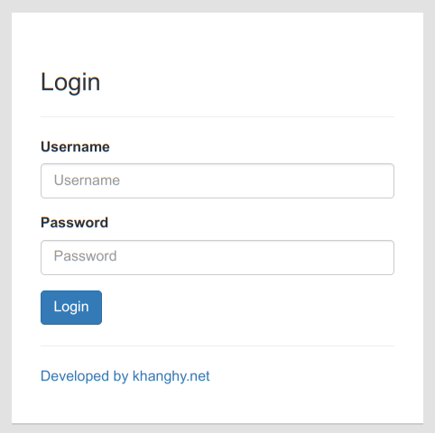
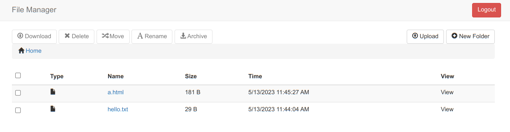
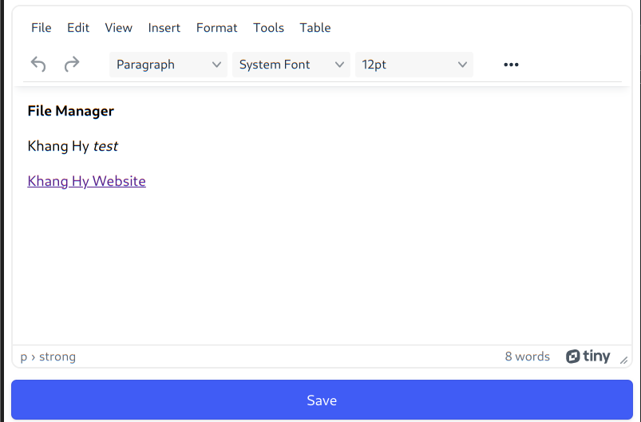

# Nodejs File Manager
Login, manager, edit, download, rename, delete,...
## Screen Shot
| ) | 
|:--:| 
| *Login* |

|  | 
|:--:| 
| *Dashboard* |

| ) | 
|:--:| 
| *Edit* |
 
## Usage

```sh
  git clone https://github.com/khanghy3004/node-file-manager.git
  cd node-file-manager
  npm i
  cd lib
  node --harmony index.js -p 8080 -d /path/to
```

We can run node-file-manager in terminal directly. We can specify prot add data root dir by `-p` and `-d`, default with 5000 and scripts directory.

Then, we can view localhost:8080/ in our browr.
